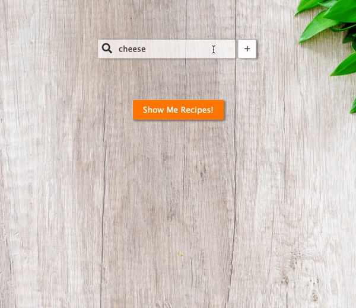
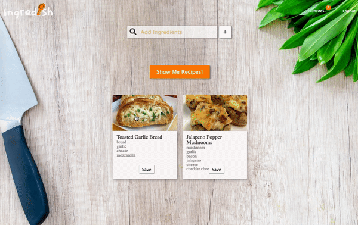
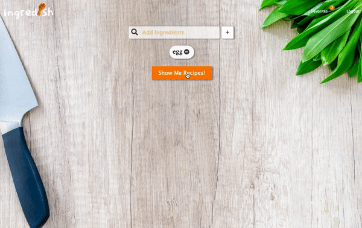
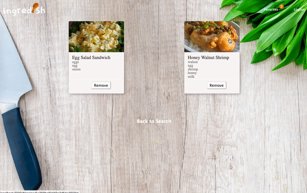

[](https://ingredish.herokuapp.com/)

# 

ingredish is a web application that provides various food recipes based on the searched ingredients and allows users to save recipes on to their favorites list. Additionally, users are able to leave public comments on each recipe that are available to other users.

&nbsp;


# Technologies
* Backend: `MongoDB`, `Express.js`, `JavaScript`
* Frontend: `React/Redux`, `Node.js`, `JavaScript`

# Features and MVPs
## User authorization
* Securely salt and hash users' passwords using BCrypt
* Allow users to sign up, login, and logout

```javascript 
bcrypt.genSalt(10, (err, salt) => {
    bcrypt.hash(newUser.password, salt, (err, hash) => {
        newUser.password = hash;
        newUser
            .save()
            .then(user => { 
                const payload = { id: user.id, handle: user.handle };
            jwt.sign(
                payload,
                keys.secretOrKey,
                { expiresIn: 3600 },
                (err, token) => {
                    res.json({
                    success: true,
                    token: "Bearer " + token
                });
                }
            )})
            .catch(err => console.log(err));
    });
}
```

## Search
* Using predefined keywords, users can search recipes using ingredients
* List recipes that match search keywords



```javascript
async getKeywordValid() {
    try {
        let search = this.state.searchVal;
        let res = await fetchKeyword(this.state.searchVal);

        if (res.data && !this.state.searchTerm.some(ing => ing === search)) {
            this.setState({
                searchTerm: [...this.state.searchTerm, search],
                keywordValid: true,
                alreadyEnteredIng: false
            });
        } else if (this.state.searchTerm.some(ing => ing === search)) {
            this.setState({
                alreadyEnteredIng: true,
                keywordValid: true
            });
        } else {
            this.setState({
                keywordValid: false
            });
        }
    } catch (err) {
        console.log(err.message);
    }
}
```

## Recipes
* Show the detailed information of the recipe once user clicks on the choice



```javascript
class RecipeDetail extends React.Component {
    constructor(props) {
        super(props);
        this.state = {
            comment: "",
            recipe: this.props.getRecipe(this.props.match.params.recipeId),
            commentsToggle: true
        };
        this.handleSubmit = this.handleSubmit.bind(this);
    }
```

## Favorites
* Users can save recipes to their favorites list



```javascript
router.post("/:id/recipes", (req, res) => {
    User.findById(req.params.id)
        .then(user => {
            user.saved_recipes.push(Object.keys(req.body)[0]);
            user.save();
            Recipe.find({ _id: { $in: user.saved_recipes } }).then(objects => {
                res.json(objects);
            });
        })
})
```

## Comments
* Once users land on a recipe show page, user is able to add a comment on to the comments field which lets them share their opinions about the recipe with other users.



```javascript
async getComments() {
    try {
        let recipe = await this.props.addComment(
        this.props.recipeId,
        this.state.comment
        );
        this.setState({ recipe: recipe });
    } catch (err) {
        console.log(err.message);
    }
}
```

```javascript
handleSubmit() {
    this.getComments();
    this.setState({
        comment: "",
        commentsToggle: false
    });
}

<form onSubmit={this.handleSubmit}>
    <label className="comment-text" htmlFor="">
        Your comment:
        <input
        className="comment-input"
        type="textarea"
        value={this.state.comment}
        placeholder="Leave a comment"
        onChange={this.update("comment")}
        required
        />
    </label>
    <button className="comment-button" type="submit">
        +
    </button>
</form>
```

## Responsive UI Design
* Responsive UI design allowing dynamic changes for better user experience on different types of devices


```css
@media only screen and (max-width: 600px) {
    .logo {
        width: 160px;
        height: 60px;
        margin-top: -5px;
    }

    .right-links button {
        display: none;
    }

    .navbar {
        position: fixed;
        top: 2%;
        width: 100vw;
        background-color: rgba(17, 17, 17, 0.3);
        height: 40px;
    }

    .nav-icon, .nav-icon-active {
        top: 0;
        right: 0;
        margin: 1.2em;
        width: 35px;
    }

```

## Future Plans
* Allow users to add their own recipes


<!-- ---
## Group Members

Anne Wong &nbsp;&nbsp;
[](https://github.com/hiuhin) 

Benjamin Huh &nbsp;&nbsp;
[](https://github.com/benjaminhuh) 

Nandhu Kuppusamy &nbsp;&nbsp;
[](https://github.com/knandhu) 

Noel Seo &nbsp;&nbsp;
[](https://github.com/noelseo) 
 -->
